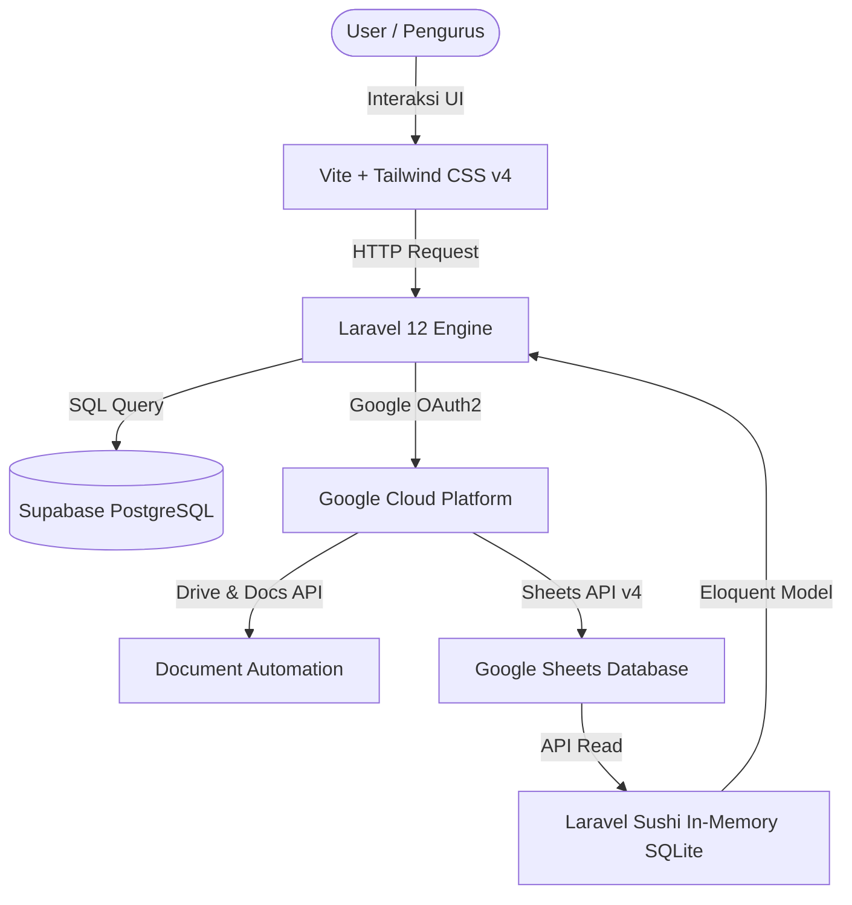

# SIAP Dakwah: Cloud-Integrated Information System

> 🎬 **[Tonton Video Demo Aplikasi di Sini](LINK_VIDEO_DEMO_LOOM_ATAU_YOUTUBE_KAMU)** (Segera ganti link ini setelah merekam video)

SIAP Dakwah (Sistem Informasi Administrasi Pejuang Dakwah) adalah platform sistem informasi internal organisasi yang dirancang untuk mengotomatisasi manajemen administrasi, persuratan, notulensi rapat, dan kehadiran anggota secara real-time. 

Aplikasi ini mengintegrasikan framework PHP modern dengan ekosistem Google Workspace API untuk menciptakan alur kerja administratif tanpa kertas (*paperless*) yang efisien dan otomatis.

---

## 🚀 Masalah & Solusi (Studi Kasus)

* **Masalah Administrasi Organisasi:**
  Struktur organisasi yang luas dan tersebar (meliputi Biro/Departemen di tingkat Pusat serta Lembaga Dakwah Fakultas/LDF di berbagai fakultas) mengakibatkan data administrasi dan file penting tersimpan secara terfragmentasi atau terpecah-pecah. Meskipun masing-masing unit menggunakan Google Drive dan Excel, file-file tersebut tersebar di puluhan link yang terpisah dan tidak terintegrasi. Hal ini menyulitkan pemantauan berkas, rekapitulasi data, serta koordinasi administratif secara keseluruhan.
* **Solusi Otomatisasi:**
  SIAP Dakwah memangkas kendala koordinasi ini dengan mengintegrasikan sistem ke dalam satu portal terpusat. Aplikasi ini mengotomatisasi pembuatan dokumen Google Docs melalui API. Data absensi dan evaluasi disinkronkan secara real-time dari Google Sheets ke dashboard aplikasi menggunakan driver database *in-memory* SQLite (Laravel Sushi).
* **Dampak & Status Proyek:**
  Saat ini aplikasi sedang dalam **tahap pengujian (testing) dan pengumpulan umpan balik (feedback)** dari para kader/pengurus aktif. Proyek ini bertujuan menyatukan seluruh link dan dokumen administrasi yang berserakan menjadi satu sumber data terpusat (*single source of truth*), meningkatkan kerapian pencatatan, dan menyederhanakan birokrasi lintas fakultas.

---

## 🛠️ Tech Stack & Arsitektur

* **Core Backend:** PHP 8.2 & Laravel 12.0 (MVC Architecture)
* **Primary Database:** PostgreSQL (Hosted on Supabase) - untuk data kredensial, role user, log persuratan, dan settings.
* **Dynamic In-Memory Database:** SQLite via **Laravel Sushi** - untuk memetakan data Google Sheets langsung menjadi Eloquent Model queryable (`SesiPresensi`, `Evaluasi`, `BeritaAcara`) secara real-time.
* **Cloud API Integration:** Google Sheets API v4, Google Docs API, Google Drive API (OAuth 2.0 Refresh Token Flow).
* **Frontend Pipeline:** Blade Templates, Tailwind CSS v4.0, Vite 7.0.
* **Deployment Adaptations:** Konfigurasi serverless di Vercel dengan optimasi penyimpanan sementara `/tmp` untuk file cache, session, dan compiled views (read-only filesystem workaround).

---

## 📊 Rancangan Infrastruktur



---

## ✨ Fitur Utama

1. **Otomatisasi Notulensi & Evaluasi:** Menyalin template Google Docs, mengelompokkannya ke dalam folder Drive yang sesuai, dan mengganti *placeholder text* (seperti `[Nama Kegiatan]`, `[JUDUL SYURO]`) secara otomatis via Batch Update API.
2. **Arsip & Manajemen Surat:** Perekaman nomor surat keluar, perihal, lampiran link drive, serta logging surat masuk secara terpusat untuk mencegah duplikasi penomoran.
3. **Presensi Kehadiran Terintegrasi:** Rekapitulasi absensi rapat atau acara langsung tersinkronisasi ke Google Sheets utama yang terintegrasi dengan model Sushi untuk diekspor kembali dalam format PDF.
4. **Role-Based Access Control (RBAC):** Pembagian hak akses antara *Superadmin* (Biro Kesekretariatan) untuk kendali penuh dan *Admin Unit/Fakultas* untuk mengelola data unit mereka masing-masing.

---

## ⚙️ Cara Setup Lokal

1. **Clone Repositori:**
   ```bash
   git clone https://github.com/MNaufalMuzakki/siap-dakwah-portfolio.git
   cd siap-dakwah-portfolio
   ```

2. **Install Dependencies:**
   ```bash
   composer install
   npm install
   ```

3. **Configure Environment:**
   Salin `.env.example` menjadi `.env` dan sesuaikan konfigurasinya:
   ```bash
   cp .env.example .env
   php artisan key:generate
   ```
   Lengkapi variabel `DB_*` menggunakan PostgreSQL lokal atau cloud, serta `GOOGLE_*` dengan kredensial Google Cloud Console milik Anda.

4. **Migrate & Seed Database:**
   Jalankan migrasi database beserta data dummy yang telah disanitasi:
   ```bash
   php artisan migrate --seed
   ```
   *(Data login default akan otomatis dibuat menggunakan data contoh yang aman di `UserSeeder.php`)*

5. **Jalankan Aplikasi:**
   ```bash
   npm run dev
   ```
